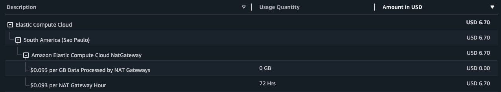

<p align="center"><a href="https://empathmsp.com/" target="_blank"></a></p>

<p align="center">
<a href=""></a>
<a href=""></a>
<a href=""></a>
<a href=""></a>
<a href=""></a>
</p>

# About
This repository contains the solution to the **Empath SST Node.js Serverless Application Challenge**, focused on building a serverless application with AWS services like DynamoDB and optionally extending functionality with RDS.  

You can find the full challenge details [here](./CHALLENGE.md).

**Deliverables:**
- [A fully functional **Node.js-based** SST application, including DynamoDB integration](https://github.com/devmatsu/empath-challenge/milestone/1?closed=1):
	- [Create `/random` Endpoint](https://github.com/devmatsu/empath-challenge/issues/2)
 	- [Integrate DynamoDB Logging](https://github.com/devmatsu/empath-challenge/issues/3)
	- [Create `/random/logs` Endpoint](https://github.com/devmatsu/empath-challenge/issues/4) 
- [Unit tests for Lambda functions using a Node.js testing framework.](https://github.com/devmatsu/empath-challenge/issues/6)
- [Documentation in the `README.md` file with setup, deployment, and endpoint details.](https://github.com/devmatsu/empath-challenge/issues/5)
- [Deploy the application to AWS, providing deployment details and API URLs.](https://github.com/devmatsu/empath-challenge/issues/8)
-  *(Bonus)* [Add `/data` route with AWS RDS integration for JSON storage.](https://github.com/devmatsu/empath-challenge/issues/7)

---

## Installation

### Prerequisites
- **Node.js** (LTS version recommended, [install here](https://nodejs.org))
- **AWS CLI** ([guide](https://aws.amazon.com/cli)) with configured credentials. (To run locally you need to have AWS credentials setup)
- **SST CLI** ([setup guide](https://sst.dev)).
- **Docker** ([download](https://www.docker.com)) for running a local PostgreSQL instance during development.


### Steps to run 
1. Start a local PostgreSQL database using Docker:
    ```bash
    docker run \
      --name postgres-dev \
      -e POSTGRES_USER=postgres \
      -e POSTGRES_PASSWORD=password \
      -e POSTGRES_DB=local \
      -p 5432:5432 \
      -d postgres
    ```

2. Clone the repository:
    ```bash
	git clone https://github.com/devmatsu/empath-challenge
    ```

3. Install dependencies:
    ```bash
  	npm install
    ```

4. Start the SST development environment:
    ```bash
  	sst dev
    ```

If everything is correct, it should return something like this:

> ```bash
>  ✓  Complete
>     MyApi: https://ab1cde23fg.execute-api.sa-east-1.amazonaws.com
>      	---
>     table: empath-challenge-stage-GeneratedNumbersTable
>     url: https://ab1cde23fg.execute-api.sa-east-1.amazonaws.com
> ```


## Deployment
### Custom Domain Configuration (Optional)
First, ensure the custom domain is set up in Route 53. To use a custom domain for the API, configure the following before deploying the stack:
```bash
  export USE_CUSTOM_DOMAIN=true
  export DOMAIN=api.devmatsu.com
```
- USE_CUSTOM_DOMAIN: Set this to true to enable the custom domain configuration.
- DOMAIN: Specify the custom domain name (e.g., api.devmatsu.com).

### Deploy the Stack
Deploy the application to AWS using the SST CLI. This will provision all necessary resources (e.g., API Gateway, DynamoDB).
```bash
  sst deploy --stage production
```


## API Endpoints & Usage
### 1. Generate Random Number  
Endpoint: GET `/random`  
Generates and returns a random number. The number is also stored in DynamoDB with a timestamp.
Request:
```
  curl -X GET http://<your-api-url>/random
```
Deployed API Example:
```bash
  curl -X GET https://api.devmatsu.com/random
```

Response:
```json
  {
    "randomNumber": 1234
  }
```

### 2. Retrieve Last 5 Generated Numbers
Endpoint: GET `/random/logs`  
Retrieves the last 5 random numbers stored in DynamoDB.
Request:
```
  curl -X GET http://<your-api-url>/random/logs
```
Deployed API Example:
```bash
  curl -X GET https://api.devmatsu.com/random/logs
```

Response:
```json
  [
    {
      "timestamp": "2025-01-15T22:58:32.911Z",
      "randomNumber": 4353
    },
    {
      "timestamp": "2025-01-15T22:58:32.776Z",
      "randomNumber": 5332
    }
  ]
```

### 3. Add Data to RDS
Endpoint: POST `/data`  
Accepts a JSON object and stores it in the RDS database.
```
  curl -X POST http://<your-api-url>/data \
  -H "Content-Type: application/json" \
  -d '{"example": true}'
```
Deployed API Example (Removed Due to Costs):
```bash
  curl -X POST https://api.devmatsu.com/data \
  -H "Content-Type: application/json" \
  -d '{"key": "value"}'
```
> **Note:** This route is no longer operational in production. The PostgreSQL instance and NAT Gateway were removed due to costs, as the NAT Gateway was only being used by PostgreSQL.


Response:
```json
  {
    "id": 1,
    "data": {
      "example": true
    }
  }
```
